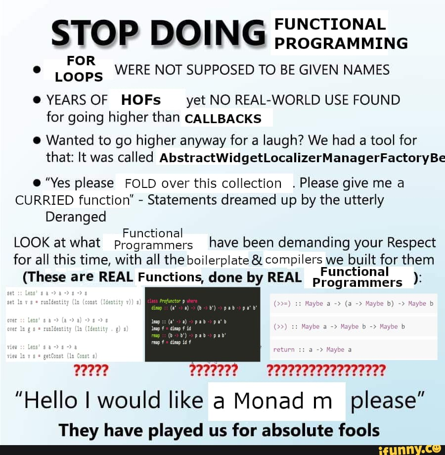

<!--
speaker_note: |
  - schwieriges thema
  - sehr kontrovers
  - hier: einige grundlagen
-->

Video

<!-- end_slide -->

<!-- jump_to_middle -->
Ui weh.
=

<!-- end_slide -->

<!-- jump_to_middle -->

Clean Code.
= 

<!-- pause --> 

Was?
= 

<!-- end_slide -->


_Abb. 1: Die Bibel_

<!--
speaker_note: |
  - kontrovers
  - keine leute einfach töten <=> naja wenn dein sohn sich nicht benimmt steinige ihn halt
-->

<!-- pause -->

(5. Mose 21:18-21)

<!-- end_slide -->


_Abb. 2: Clean Code: A Handbook of Agile Software Craftsmanship_

<!-- end_slide -->

<!-- jump_to_middle -->
There will be code.
=

<!--
speaker_note: |
  - 1. kapitel in dem buch
  - code ist die ebene zwischen mensch und maschine
  - egal wie abstrakt, code muss es geben
  - deshalb: hier auch codebeispiele, primär in C und etwas html/js
  - also: sauberer code ist wichtig
-->

<!-- end_slide -->


> You can either hang out in the Android loop or in the HURD loop.

*Abb. 3: xkcd 844*

<!-- end_slide -->

<!-- jump_to_middle -->
Was machen wir dann jetzt? 
=

<!--
speaker_note: |
  - grundprinzipien zur anwendung
  - allgemein gilt: programmieren <=> tischlerei, lernt man nicht durchs zuschauen
  - selber ausprobieren!
-->

<!-- end_slide -->

DRY (Don't Repeat Yourself)
=

```file +line_numbers
path: wet.c
language: c
```

<!-- end_slide -->
DRY (Don't Repeat Yourself)
=

```file +line_numbers {4-5,15-16}
path: wet.c
language: c
```

<!-- end_slide -->
DRY (Don't Repeat Yourself)
=

```file +line_numbers {6-9,11,17,20}
path: wet.c
language: c
```

<!-- end_slide -->
DRY (Don't Repeat Yourself)
=

```file +line_numbers {4-8,11}
path: dry.c
language: c
```

<!-- end_slide -->
SoC (Seperation of Concerns)
=

```
$ tree website/
website/
├── index.html
├── index.js
└── main.css
```

<!-- end_slide -->
Content Warning: JavaScript
=

<!-- end_slide -->

SoC (Seperation of Concerns)
=

```html
<!-- index.html -->

<button id="login">Log in</button>
```

```js
// index.js

document.getElementById("login").onclick = async () => {
	await fetch("/api/login", { method: "POST", body: getBody() });
};
```

<!-- pause -->

```svelte
<!-- button.svelte -->

<button onclick={() => fetch("/api/login", { method: "POST", body: getBody() })}>Log in</button>
```

<!-- pause -->

(Bitte tut euch das nicht an, es ist nur ein Beispiel)

<!-- end_slide -->
Anwendung
=

```file +line_numbers
path: crime.c
language: c
```

<!-- end_slide -->
Anwendung: Formatting
=

```file +line_numbers
path: formatted.c
language: c
```

<!-- end_slide -->

Anwendung: Linting
=

```shell
$ clang -Wall -Wextra formatted.c
formatted.c:6:12: warning: unused variable 'size' [-Wunused-variable]
    6 |     size_t size;
      |            ^~~~
formatted.c:18:9: warning: unused variable 'unused_flag' [-Wunused-variable]
   18 |     int unused_flag = 0;
      |         ^~~~~~~~~~~
2 warnings generated.
```

<!-- end_slide -->

Anwendung: Linting
=

```file +line_numbers {6,18}
path: formatted.c
language: c
```

<!-- end_slide -->

Anwendung: Linting
=

```file +line_numbers
path: fix1.c
language: c
```


<!-- end_slide -->

Anwendung: Magic Values
=

```file +line_numbers {4,18-20}
path: fix2.c
language: c
```


<!-- end_slide -->

Anwendung: Guard Clauses
=

```file +line_numbers {23-34}
path: fix3.c
language: c
```


<!-- end_slide -->

Anwendung: Guard Clauses
=

```file +line_numbers {28-34}
path: fix4.c
language: c
```


<!-- end_slide -->

Anwendung: Guard Clauses
=

```file +line_numbers {33}
path: fix5.c
language: c
```

<!-- end_slide -->
Einschub: Funktionale Programmierung
=



<!--
speaker_note: |
  - schöne art code zu strukturieren
  - keine sekte
  - erlaubt oft, code lesbarer zu schreiben
  - bei arrays immer nützlich
  - in c / für PT: nix ist
  - auf jeden fall keine sekte
-->

<!-- end_slide -->

Medienverzeichnis
=

- Video: <https://www.youtube.com/watch?v=7EmboKQH8lM>
- Abb. 1: <https://isbndb.com/book/9783730602737>
- Abb. 2: <https://isbndb.com/book/9780132350884>
- Abb. 3: <https://xkcd.com/844/>

<!-- end_slide -->
Literaturempfehlungen
=

- <https://grugbrain.dev/>
- <https://htmx.org/essays/locality-of-behaviour/>
- <https://www.youtube.com/@CodeAesthetic>

<!-- end_slide -->