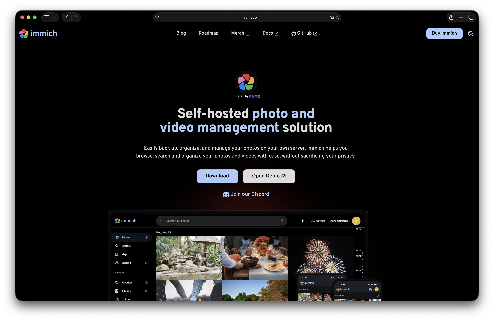
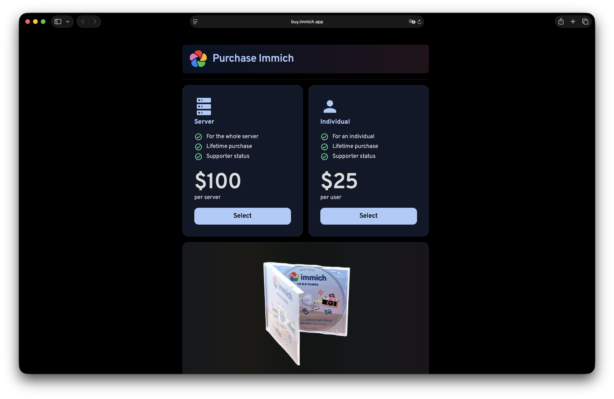
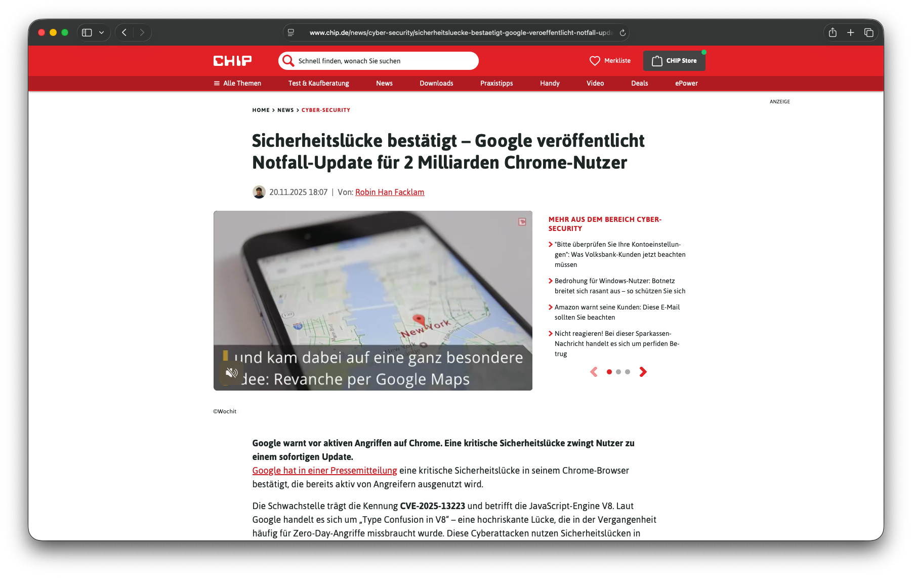
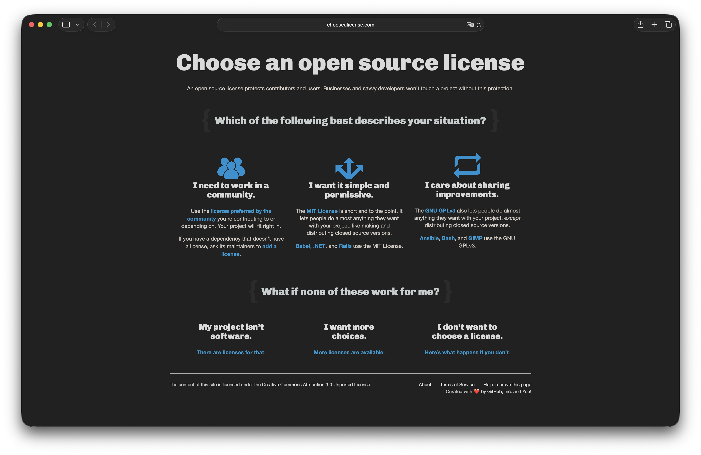
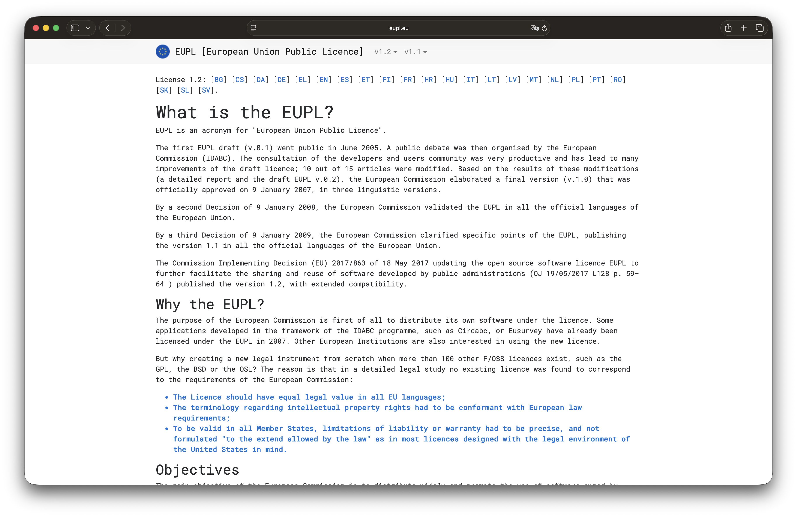
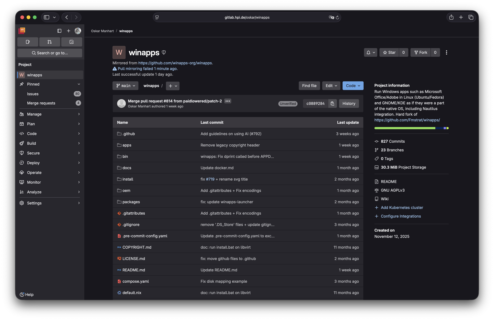
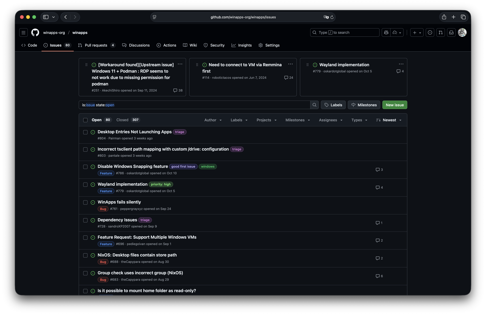
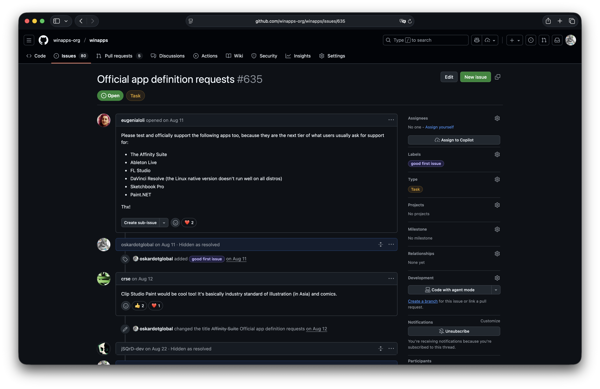
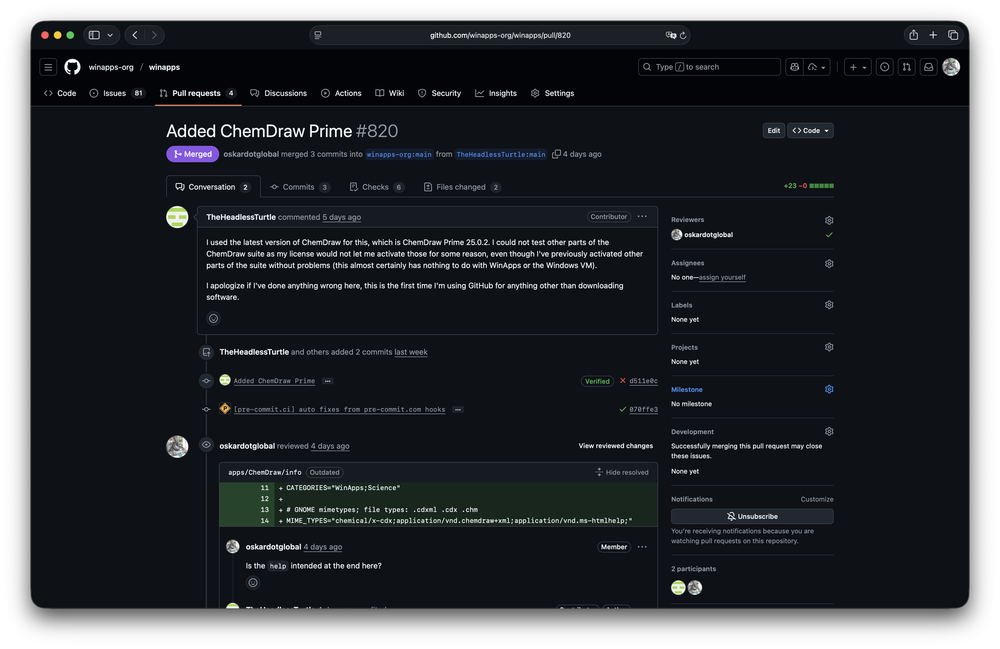

<!-- jump_to_middle -->

 

oskardotglobal/presentations
=

<!-- end_slide -->

Inhalt
= 

<!--
speaker_note: |
  - Git knowledge check
  - Zweck: dieses oder nächstes Projekt weiterführen
  - der welt zeigen, was man gemacht hat
-->

- Was bedeutet Open-Source eigentlich?
- Was bringt uns das?

<!-- pause -->

Als Maintainer:
- Open-Source-Lizenzen
- Git-Hoster
- GitHub: Issues
- GitHub: Pull Requests

<!-- end_slide -->

Was bedeutet Open-Source?
=

<!-- jump_to_middle -->

<!--
speaker_note: |
  - erster gedanke> software mit einsehbaren quellcode
  - aber das stimmt eigenbtlich garnicht
-->

> **Definition**: Open-Source Software (I)
> = Software, dessen Quellcode einsehbar ist

<!-- end_slide -->

Was bedeutet Open-Source?
=

<!--
speaker_note: |
  - damit gemeint>quellverf[bare software]
  - sog. source available (z. B. bald Minecraft)
  - einsehbarer quellcode Aber keine rechte daran
  - das heist nur ansehen,keinen weiteren nutyen
  
-->

<!-- jump_to_middle -->

> **Definition**: Source-available Software
> = Software, dessen Quellcode verfügbar ist

<!-- pause -->

> **Definition**: Open-Source Software (II)
> = Software, dessen Quellcode frei zur Modifikation und Redistribution verfügbar ist

<!-- end_slide -->

Open-Source und Freie Software
=

<!-- jump_to_middle -->

<!--
speaker_note: |
  - formale definition,die daraus folgt
  - meist das, was man mit open source meint
  - nach FSF, der freien software foundation 4 kriterien

  - in der praxis nicht immer genau so aber meist ähnlich
  - fachbegriff FOSS: free and open source software

-->

> **Definition**: Freie und Quelloffene Software (FOSS)
> 1. Verwendung der Software für jeden Zweck 
> 2. Lesen und Verändern des Quelltextes für eigene Zwecke
> 3. Freiheit, Kopien der Software zu verbreiten
> 4. Freiheit, modifizierte Kopien der Software zu verbreiten

<!-- end_slide -->

Freie Software: Immich
=

<!--
speaker_note: |
  - gesprochen image
  - freie alternative zu google ,icloud photos
  - z.B gesichtserkennung lokal und privat
-->

<!-- end_slide -->

Freie Software: Immich
=

<!--
speaker_note: |
  - einmalige lizenz kaufbar aber nicht verpflichtend kaufbar
  - lediglich für enrtwickler spende
  - unendlich gültig

-->

<!-- end_slide -->

Wieso freie Software?
=

<!--
speaker_note: |
  - gegenteil dazu erstmal>proprietäre software 
  - dabei quellcode nicht einsehbar und kontrollierbar
  - nachteil> du weist nicht was mit deinen daten passiert
  - bsp. tiktok,insta,google etc.
  - fokjus>geld 
  - bild erklären
  - quellenoffene software trotydem sicherheitsl[cken,da mehr r[ber lesen ]]
-->

Quelle: https://www.chip.de/news/cyber-security/sicherheitsluecke-bestaetigt-google-veroeffentlicht-notfall-update-fuer-2-milliarden-chrome-nutzer_11c337b2-b1db-4f77-86f0-f4e1f9250fc5.html

<!-- end_slide -->

Wieso freie Software?
=

<!-- 
speaker_note: |
  - technologien und fortschritt international frei teilen
  - fokus>fortschritt für die menschheit 
  - zitat  von befürworter freie software
  - wer kennt edward snowden?
  - edward snowden nsa whistleblower 
-->

<!-- jump_to_middle -->

> "We can't compete with Apple, we can't compete with Google, directly, in the field of resources. What we can eventually do is head count and heart count. We can compete on the ground of ideology because ours is better."
> \-- Edward Snowden

<!-- end_slide -->

Open-Source-Lizenzen
=

<!--
speaker_note: |
  - def vorlesen
  - Bekannte Lizenzen sinnvoll -> User/Contributor kennen die Bedingungen / können sie einfach nachschauen
  - lizenz macht eine software überhaupt erst quelloffen
-->

<!-- jump_to_middle -->

> **Definition**:  Softwarelizenz
> = Dokument, welches Rechte und Pflichten der Nutzer gegenüber der Autoren einer Software beschreibt

<!-- pause -->

> [!warning]
> Ein (öffentliches) Projekt ohne Open-Source-Lizenz ist quellverfügbar, aber nicht quelloffen!

<!-- end_slide -->

Open-Source-Lizenzen
=

<!--
speaker_note: |
  - verschiedene arten von lizenzen
  - Copyleft> alle Werke basierend auf dem Original müssen auch unter der gleichen lizenz lizensiert werden
  - gegenteil copyright
  - bsp. gpl 
  - permissive lizenz: freie Verwendung unter Namensnennung
  - bsp. MIT
  - ossi bsp. zeigen
-->

<!-- end_slide -->

Open-Source-Lizenzen
=

<!--
speaker_note: |
  - emphelung von uns copyleft lizenz>GPL-ähnlich, aber in ganz EU gültig
  - bekannt genug als eupl
  - Gesetzestexte in allen EU-Sprachen
-->

<!-- end_slide -->

Git-Hoster: GitLab
=

<!--
speaker_note: |
  - Gitlab: Einsatz für Unternehmen
  - Codeberg: wirklich offen
-->

<!-- end_slide -->

Git-Hoster: GitHub
=

<!--
speaker_note: |
  - Github: Microsoft's Datenkrake, aber das meist verbreitete
  - Plattform für Kollaboration & Planung
  - Issues: Bug Reports
  - Pull Requests: Vereinfachung der Kollaboration
  - Wikis: Hosten von Dokumentation
  - macht projekte tendenziell mehr discoverable, ist aber wie bei jeder social media plattform hit and miss
  - show of hands wer WA kennt?
-->

<!-- end_slide -->

GitHub: Issues
=

<!--
speaker_note: |
  - Project tracking
  - Bug reporting
-->

<!-- end_slide -->

GitHub: Issues
=

<!--
speaker_note: |
  - Task issue type für projektmanagement
  - 'good first issue' label als indicator für externe contributor
-->

<!-- end_slide -->

GitHub: Pull Requests
=

<!--
speaker_note: |
  - Merge Conflicts verhindern
  - Contributing vereinfachen
  - Contributions nachvollziehen
-->

<!-- end_slide -->

GitHub: Pull Requests
=

<!--
speaker_note: |
  - Best practices
  - Nur Pull requests erlauben, nicht direkt pushen => branch rules
  - (Lizensierung erbitten)
  - PRs reviewen
  - Beispiel: https://github.com/winapps-org/winapps/pull/308
-->

<!-- end_slide -->

<!-- jump_to_middle -->

Jetzt seid ihr dran.
=

<!-- end_slide -->

<!--
speaker_note: |
  - Fehler finden (keine license)
  - Fork (Kopie auf eigenem Account) erstellen 
  - PR eröffnen
  - Code review
-->

<!-- jump_to_middle -->

 

hpi25/git-it
=

<!-- end_slide -->

<!-- jump_to_middle -->

Fragen?
=

<!-- end_slide -->

Medienverzeichnis
=

- Abb. 1: https://github.com/logos
- Abb. 2: https://creativecommons.org/share-your-work/cclicenses/

<!-- end_slide -->
Literaturempfehlungen
=

- https://www.gnu.org/philosophy/free-sw.html
- https://www.gnu.org/proprietary/
- https://opensource.guide/

<!-- end_slide -->
